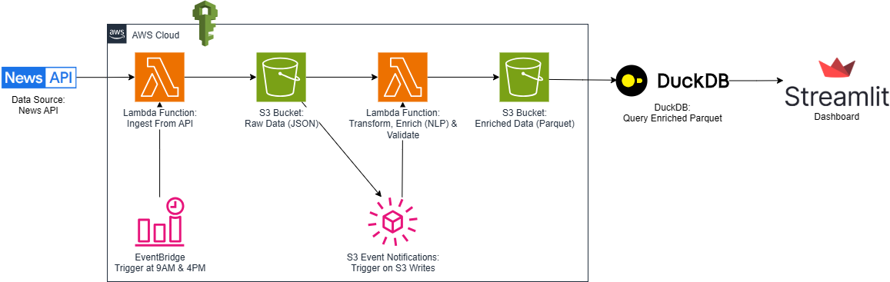

# Event-Driven Serverless Pipeline for Real-Time Financial News NLP and Sentiment Scoring

A fully serverless, event-driven data pipeline that ingests, enriches, validates, and visualizes real-time financial news data using AWS services. Designed for cost-efficient, scalable deployment using Terraform and only free-tier AWS services.

## Problem Statement
In financial markets, timely insights from news can significantly influence investment decisions, risk assessments, and trading strategies. However, traditional news processing pipelines are batch-oriented, resource-intensive, and lack scalability. This project addresses these challenges by offering a real-time, serverless architecture to ingest and analyze financial news with NLP-based sentiment scoring. The entire pipeline is infrastructure-as-code using Terraform and exposes enriched insights via a low-latency, self-service dashboard — enabling traders, analysts, and portfolio managers to monitor sentiment across companies, sectors, and macroeconomic themes as it unfolds.

## Features

- **Infrastructure-as-Code**: All AWS infrastructure managed using Terraform
- **Scheduled ingestion** at 9AM and 5PM each day using EventBridge
- **NLP scoring** using VADER for sentiment scoring & classification
- **Data quality validation** with Python & pandas library
- **Lightweight querying** with DuckDB
- **Interactive Streamlit dashboard** with sentiment gauge, sentiment heatmaps, source analysis, and refresh button
- **Basic error logging via AWS CloudWatch for both Lambda functions**  
- **Dashboard deployed on Streamlit Cloud** for easy sharing and low-latency access

## Live Dashboard Preview
  
_Deployed Streamlit Cloud dashboard showcasing real-time news sentiment scoring, powered by a serverless AWS pipeline._

## Tech Stack

**Cloud:** AWS Lambda · AWS S3 · AWS EventBridge · Streamlit Cloud  
**Infrastructure Management**: Terraform (IaC)
**Data Processing:** Python · pandas · VADER · boto3  
**Storage Formats:** JSON (raw data), Parquet (enriched data)  
**Query Engine**: DuckDB  
**Dashboarding & Visualization:** Streamlit

## Components

| Layer            | Technology                 | Description |
|------------------|----------------------------|-------------|
| **Data Source**   | [News API](https://newsapi.org) | Provides real-time news articles for ingestion |
| **Ingestion**     | AWS Lambda + EventBridge   | Triggers news ingestion at 9AM/5PM daily |
| **Storage**       | Amazon S3                  | Stores raw JSON (Bronze) and enriched Parquet (Silver) |
| **Processing**    | AWS Lambda + VADER         | Performs sentiment scoring and data transformation |
| **Validation**    | Python (pandas)            | Applies custom validation: schema checks, null filtering, sentiment score ranges |
| **Query Layer**   | DuckDB                     | Runs SQL queries directly on Parquet files in S3 |
| **Visualization** | Streamlit                  | Displays sentiment scores, trends, and manual reloads |

## Architecture Flow (Step-by-Step)

_Serverless data pipeline using AWS Lambda, EventBridge, and S3 event notifications to process news data through ingestion, NLP transformation, validation, and analytics via DuckDB and Streamlit. All infrastructure components are deployed via Terraform._

1. **News Ingestion**  
   EventBridge triggers a Lambda function twice daily to fetch news from NewsAPI, storing the raw JSON in an S3 `raw` bucket.

2. **Event-Driven Enrichment**  
   An S3 Event Notification invokes a second Lambda that:
   - Parses and enriches the data with NLP sentiment scores
   - Applies `pandas`-based validation
   - Writes the result as Parquet to a separate S3 `enriched` bucket 

3. **Querying & Visualization**  
   - DuckDB queries the Parquet files directly from S3 (no database needed)
   - Streamlit dashboard displays sentiment scores, source breakdowns through interactive visualizations
4. **Terraform Infrastructure Deployment**
   - S3 buckets, IAM roles, Lambda functions, EventBridge rules, and S3 notifications are provisioned using Terraform for consistency and cost-efficiency.

## Key Learnings
- Designed a cost-efficient, production-grade serverless pipeline using Terraform as IaC
- Applied event-driven architecture with AWS-native tools such as Lambda, S3, and EventBridge
- Implemented automated provisioning of all cloud resources via Terraform
- Applied custom data quality monitoring with `pandas`-based validation 
- Built a real-time dashboard to visualize sentiment insights with reload triggers
- Managed secrets securely using AWS Secrets Manager

## Terraform Infrastructure (IaC)

All AWS resources in this project are provisioned using Terraform for automation, reproducibility, and cost-effective deployment. This includes:

- S3 buckets for raw and enriched news data
- Lambda functions for ingestion and NLP enrichment
- EventBridge rules for scheduled ingestion (9AM/5PM)
- S3 event notification triggers for enrichment Lambda
- IAM roles and policies with least-privilege permissions
- Secrets Management using AWS Secrets Manager for secure API key storage

## Try It Yourself
Want to explore the live pipeline in action?  
- [Launch the Live Streamlit Dashboard](https://your-streamlit-url.com)  
- [Browse the Full Source Code on GitHub](https://github.com/nakuleshj/news-nlp-pipeline)

## Future Improvements
- Integrate with Amazon Athena or Redshift Spectrum for large-scale analytics
- Add Slack/email alerting for negative sentiment spikes

## License
This project is licensed under the [MIT License](LICENSE).  
Feel free to use, modify, and share with attribution.
